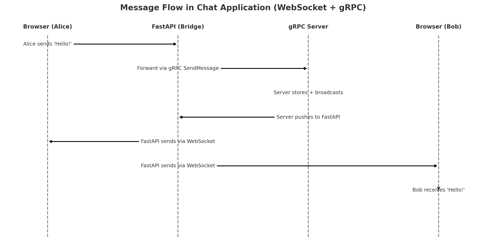

# Building a Chat Application with gRPC and WebSockets: A Step-by-Step Tutorial

## Table of Contents

1. [Introduction](#introduction)
2. [Core Concepts](#core-concepts)
3. [Building the Application](#building-the-application)
4. [Understanding the Code](#understanding-the-code)
5. [Running and Testing](#running-and-testing)
6. [Advanced Concepts](#advanced-concepts)
7. [Common Misunderstandings](#common-misunderstandings)
8. [Conclusion](#conclusion)
9. [Glossary](#glossary)


## Introduction

Imagine you’re at a busy coffee shop. Customers (clients) come in, place orders (requests), and baristas (servers) prepare drinks (responses). In the simplest form, each customer gets their coffee and leaves — the interaction is over. That’s **HTTP**.

But what if the barista and customer want to keep chatting while coffee is being made? Maybe the barista wants to update the customer: *“Your order is halfway done”* or *“We’re out of oat milk, do you want almond instead?”* — that requires a **persistent conversation channel**. That’s where **WebSockets** and **gRPC** come in.

In this tutorial, we’ll build a real-time chat application using:

* **gRPC** (like a secure, structured walkie-talkie between servers)
* **WebSockets** (like an open phone call between browser and server)
* **FastAPI** (the switchboard operator, connecting the two worlds)
* **Protocol Buffers** (the secret shorthand for passing notes efficiently)

By the end, you’ll have a chat app where multiple users can send and receive messages instantly — like a modern version of an IRC room.


## Core Concepts

### What is WebSocket?

Think of **WebSocket** as putting a direct phone line between two people. They can call each other anytime without redialing.

* **Traditional HTTP is like mailing letters.**
  You write a letter (request), send it to the post office (server), wait days, then finally get a reply (response). The conversation ends until you mail another letter.

* **WebSocket is like staying on a live phone call.**
  Once the call is connected, *both sides can talk freely, anytime, without hanging up.*

**Why is WebSocket perfect for chat?**
Because chat is like texting in real time — you don’t want to wait for letters. The server should be able to *push* messages immediately instead of waiting for you to ask: *“Anything new yet?”*


### What is gRPC?

If WebSocket is like a phone call, **gRPC** is like having walkie-talkies between different teams in different buildings. It’s designed for *computer-to-computer* conversations.

**Why gRPC?**

* Uses **Protocol Buffers** (small, efficient messages — think “military shorthand” instead of long essays).
* Supports **streaming**: imagine keeping the walkie-talkie button pressed so updates keep flowing.
* **Language-agnostic**: one server could be in Python, another in Go, and they’d still understand each other.

So, while WebSockets connect browsers to servers, **gRPC connects servers to servers**.


### What are Protocol Buffers?

Think of **Protocol Buffers (protobuf)** as a secret **recipe card format**. Instead of writing the whole cooking process in sentences (like JSON does), you number the ingredients and steps.

* **JSON** is like writing:

  > “Take 2 cups of flour, mix with 1 cup of sugar…” (lots of words, easy for humans, bulky for computers).

* **Protobuf** is like:

  > “1: flour (2 cups), 2: sugar (1 cup) …” (short, precise, easy for computers, harder for humans).

Result: smaller messages, faster processing, less network traffic.


## Building the Application

### Step 1: Define the Protocol (proto file)

Think of this like drawing up a **contract** that all parties must follow.

`protos/chat.proto`:

```protobuf
syntax = "proto3";
package chat;

service ChatService {
    rpc SendMessage(ChatMessage) returns (ChatResponse);
    rpc StreamMessages(StreamRequest) returns (stream ChatMessage);
}
```

* `SendMessage`: like mailing one message.
* `StreamMessages`: like tuning into a radio station that keeps broadcasting.


### Step 2: Generate Python Code

Run:

```bash
make proto
```

This creates:

* `chat_pb2.py`: **the dictionary of allowed message types**
* `chat_pb2_grpc.py`: **the instructions on how to use them**


### Step 3: Implement the gRPC Server

The gRPC server is like the **chat room manager**: it receives new messages and hands them out to everyone else.

```python
class ChatServiceServicer(chat_pb2_grpc.ChatServiceServicer):
    def __init__(self):
        self.messages = deque(maxlen=100)  # last 100 messages
        self.active_streams = []           # who’s listening now
```

* **SendMessage**: when someone speaks, add it to the log, then announce to the room.
* **StreamMessages**: when someone enters, replay recent history, then keep feeding new lines live.


### Step 4: Create the FastAPI Bridge

The bridge is like the **bouncer at the chat room door**: browsers can't speak gRPC directly, so FastAPI translates WebSocket chatter into gRPC calls.

```python
@app.websocket("/ws/{username}")
async def websocket_endpoint(websocket: WebSocket, username: str):
    await manager.connect(websocket, username)
    stream_task = asyncio.create_task(stream_messages(username, websocket))
    ...
```

**Critical Implementation Detail: Async vs Sync**

One tricky part is handling gRPC's blocking streams in FastAPI's async world:

```python
# ❌ WRONG - This blocks the event loop!
async def stream_messages():
    for message in grpc_stub.StreamMessages():  # Blocking!
        await websocket.send(message)

# ✅ CORRECT - Run blocking code in a thread
async def stream_messages():
    with ThreadPoolExecutor() as executor:
        future = loop.run_in_executor(executor, get_next_message)
        message = await future  # Non-blocking await
```

Think of it like this: if the bouncer (FastAPI) stops everything to listen to one walkie-talkie (gRPC), nobody else can enter or leave the club. By using a helper (thread), the bouncer can keep doing their job while the helper listens to the walkie-talkie.

**Flow:**
Browser → FastAPI → gRPC Server → all browsers



### Step 5: Build the Frontend

A simple webpage (`index.html`) where users can join the chat:

```javascript
ws = new WebSocket(`ws://localhost:8000/ws/${username}`);
ws.send(JSON.stringify({ message: "Hello!" }));
ws.onmessage = (event) => {
    displayMessage(data.username, data.message);
};
```


## Understanding the Code

### Message Flow in Action

1. Alice types: *“Hello!”*

   * Browser → WebSocket → FastAPI → gRPC → Server

2. Server says: *“Broadcast this!”*

   * gRPC → FastAPI → WebSocket → All Browsers

It’s like passing a note in class, but the teacher (server) makes sure everyone gets a copy.


### Threading and Queues

Servers can get overwhelmed if 100 people talk at once. That’s why:

* gRPC uses **threads** → like having multiple baristas so no one waits too long.
* A **message queue** ensures order → like putting all coffee orders on a rail so baristas handle them in sequence.


### WebSocket Connection Manager

FastAPI tracks who’s in the room:

```python
self.active_connections: Dict[str, WebSocket] = {}
```

Like a guest list at a party, so the host knows who to pass messages to.


## Running and Testing

### Start the Application

1. **Terminal 1: Start gRPC server**
   ```bash
   make grpc
   ```

2. **Terminal 2: Start FastAPI server**
   ```bash
   make web
   ```

3. **Browser: Open chat interface**
   - Navigate to `http://localhost:8000`
   - Open multiple tabs to simulate different users
   - Enter different usernames and start chatting!

### What You'll See

**gRPC Server Output:**
```
gRPC server started on port 50051
```

**FastAPI Server Output:**
```
INFO:     Uvicorn running on http://0.0.0.0:8000
INFO:     WebSocket connection accepted
```


## Advanced Concepts

### Common Pitfalls and Solutions

**The Async/Sync Mismatch Problem**

When combining async frameworks (like FastAPI) with sync libraries (like gRPC's Python client), you can accidentally block your entire application:

* **Problem**: gRPC's streaming is synchronous (blocking), but FastAPI is asynchronous
* **Symptom**: WebSocket connections hang, UI freezes after clicking "Join Chat"
* **Solution**: Use `run_in_executor` to run blocking code in separate threads

This is like having a single cashier (event loop) at a busy store. If they stop to count all the money in the register (blocking operation), the line stops moving. The solution is to have someone else count the money (separate thread) while the cashier keeps serving customers.

### Architecture Patterns

* **Microservices pattern**: separate waiters for coffee, food, and payments. Each server handles one job.
* **Streaming vs Polling**:

  * Polling = keep asking "Are we there yet?" every 5 minutes.
  * Streaming = parent tells you the moment you arrive.

## Common Misunderstandings
gRPC is powerful but also a bit alien when you first meet it. Many people (myself included when I started) stumble over the same **misunderstandings and confusions**. Let me walk you through the most common ones with explanations and analogies.

### 1. **“Isn’t gRPC just like REST but faster?”**

* **Confusion:** Many people think gRPC is just “REST with steroids.”
* **Reality:** REST is resource-based (think: “/users/123”), while gRPC is *function-call based* (think: `GetUser(123)`).
* **Analogy:** REST is like ordering from a menu (“give me dish #5”), while gRPC is like asking the chef to *perform an action* (“cook me pasta with extra cheese”).


### 2. **“Browsers can connect directly to gRPC, right?”**

* **Confusion:** Beginners expect to just point their frontend at the gRPC server.
* **Reality:** Browsers can’t natively speak gRPC because of HTTP/2 streaming limitations and Protobuf parsing. That’s why we need a **bridge (like FastAPI, Envoy, or gRPC-Web)**.
* **Analogy:** A regular phone (browser) can’t connect to a military walkie-talkie (gRPC). You need a base station in the middle.


### 3. **“Do I really need Protocol Buffers? Can’t I just use JSON?”**

* **Confusion:** Why not use gRPC with JSON payloads?
* **Reality:** gRPC is tightly coupled to Protobuf for efficiency. There are hacks to use JSON, but you lose most of gRPC’s benefits.
* **Analogy:** Protobuf is like a super-compact binary Morse code. If you switch back to “regular English,” you’re shouting louder and slower.


### 4. **“Unary RPC is just like HTTP GET, right?”**

* **Confusion:** A `SendMessage` (unary) call feels like an HTTP request/response.
* **Reality:** Yes, but gRPC’s power comes from **streaming RPCs** — continuous data flows that don’t fit neatly into the request/response box.
* **Analogy:** Unary RPC = ordering a pizza once.
  Streaming RPC = subscribing to a “pizza-of-the-month club” where pizzas keep showing up.

### 5. **“If I know REST, I know gRPC.”**

* **Confusion:** REST mental models can mislead you. For example:

  * In REST, endpoints are URLs.
  * In gRPC, endpoints are *methods in a service*.
* **Analogy:** REST is like a library where you pull specific books from shelves. gRPC is like calling a librarian and asking them to *do something for you*.


### 6. **“gRPC is always faster than REST.”**

* **Confusion:** Benchmarks show gRPC is usually faster, so many think it’s *always* true.
* **Reality:** For small requests over short distances, REST may be “fast enough,” and gRPC’s complexity might not be worth it.
* **Analogy:** A bullet train is faster than a car — but if you’re only going 2 blocks, walking may still win.


### 7. **“I can just debug gRPC with curl, right?”**

* **Confusion:** With REST, `curl` works beautifully.
* **Reality:** gRPC is binary (Protobuf), so `curl` can’t easily show you results. You’ll need tools like `grpcurl` or Postman with gRPC support.
* **Analogy:** If REST is reading letters, gRPC is reading coded telegrams — you need a decoder to make sense of them.


### 8. **“Protobuf is human-readable, right?”**

* **Confusion:** Beginners open a `.pb` file expecting JSON.
* **Reality:** Protobuf is binary — efficient for machines, opaque for humans. Only the `.proto` definition is readable.
* **Analogy:** It’s like opening a ZIP file in Notepad — you’ll just see gibberish.


### 9. **“gRPC replaces WebSockets.”**

* **Confusion:** Both support streaming, so they must be alternatives.
* **Reality:** They solve different problems.

  * gRPC is best for *service-to-service communication*.
  * WebSockets are best for *browser-to-server real-time comms*.
* **Analogy:** WebSockets are like text messaging between friends. gRPC is like a corporate email server that connects entire departments.

### 10. **“One proto file = one service.”**

* **Confusion:** Some think every proto file can only define one service.
* **Reality:** A single `.proto` file can define *multiple services and messages*.
* **Analogy:** One recipe book can have multiple recipes, not just one.


### 11. **“gRPC is overkill unless you’re Google-scale.”**

* **Confusion:** Some think it’s only for FAANG-sized infrastructures.
* **Reality:** Even small projects benefit: faster communication, typed contracts, streaming. But yes, it’s more complex than REST.
* **Analogy:** A chef’s knife is professional, but you don’t need to be a Michelin-star chef to benefit from using it.

### ✨ TL;DR:
The **biggest traps** for beginners are:

* Expecting it to work like REST.
* Assuming browsers can connect directly.
* Forgetting that debugging is harder since it’s binary.
* Overestimating performance benefits without considering trade-offs.


## Conclusion

You now have a **real-time, production-ready chat**:

* WebSockets keep browsers chatting live.
* gRPC connects backend services efficiently.
* Protocol Buffers make communication lean and fast.

From here, you could extend into video calls, file sharing, or mobile apps.


## Glossary (Beginner-Friendly)

* **RPC**: Remote Procedure Call — like asking your friend to do your homework over the phone.
* **Protobuf**: Shorthand recipe cards for data.
* **WebSocket**: Staying on a phone call instead of mailing letters.
* **Streaming RPC**: Like a live radio station.
* **Unary RPC**: One-off call, like ordering pizza once.
* **Servicer**: The actual worker on the server side.
* **Stub**: The remote control on the client side.
